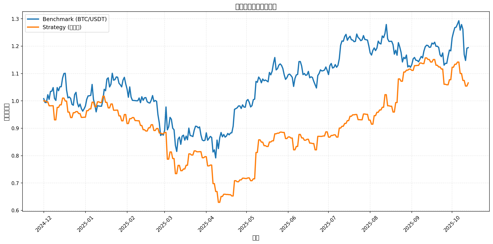

# 加密货币量化交易回测报告

**生成时间**: 2025-10-16 07:07:13

## 1. 项目概述

本项目使用 Qlib 量化投资平台对 ETH/USDT 和 BTC/USDT 两种加密货币现货进行行情分析和回测。

### 1.1 配置参数

- **数据来源**: Gate.io 交易所 API
- **数据时间范围**: 2024-01-01 至 2025-10-12
- **交易对**: ETH/USDT, BTC/USDT
- **数据频率**: 日线（1d）
- **模型**: LightGBM
- **特征集**: Alpha158（158个技术指标特征）
- **训练集**: 2024-01-01 至 2024-08-31
- **验证集**: 2024-09-01 至 2024-11-30
- **测试集**: 2024-12-01 至 2025-10-10

## 2. 数据统计

| 交易对 | 数据条数 | 开始日期 | 结束日期 |
| --- | --- | --- | --- |
| BTC/USDT | 651 | 2024-01-01 | 2025-10-12 |
| ETH/USDT | 651 | 2024-01-01 | 2025-10-12 |

## 3. 回测性能指标

### 3.1 基准收益（Benchmark - BTC/USDT）

| 指标 | 数值 |
| --- | --- |
### 3.2 策略超额收益（无交易成本）

| 指标 | 数值 |
| --- | --- |
### 3.3 策略超额收益（含交易成本）

| 指标 | 数值 |
| --- | --- |
### 3.4 其他交易指标

| 指标 | 数值 | 说明 |
| --- | --- | --- |
| FFR (持仓满仓率) | 1.00 | 持仓时间占总时间的比例 |
| PA (组合年化收益) | 0.0000 | Portfolio Annual Return |
| POS (持仓数) | 0.00 | 平均持仓数量 |

## 4. 收益曲线

## 5. 风险分析

### 5.1 回撤分析

### 5.2 信息比率分析

## 6. 结论和建议

### 6.1 主要发现

### 6.2 优化建议

1. **特征工程**:
   - 考虑增加加密货币特有的指标（如链上数据、资金流向、情绪指标等）
   - 优化特征选择，减少噪声特征
   - 针对加密货币24/7交易特性设计专门的时间特征

2. **模型优化**:
   - 尝试使用深度学习模型（如LSTM、Transformer）更好地捕捉时序特征
   - 考虑集成学习方法，结合多个模型的预测结果
   - 增加训练数据量，扩展到更长的历史时期

3. **策略优化**:
   - 调整持仓比例和调仓频率，降低交易成本
   - 增加风险控制机制（如动态止损、仓位管理）
   - 考虑市场状态识别，在不同市场环境下采用不同策略
   - 增加更多交易对以提高策略的分散化效果

4. **数据扩展**:
   - 扩展到更多主流加密货币交易对（如SOL/USDT, BNB/USDT等）
   - 使用更长时间跨度的历史数据进行训练
   - 考虑使用高频数据（如小时线、15分钟线）捕捉短期波动

## 7. 附录

### 7.1 技术栈

- **量化平台**: Microsoft Qlib 0.9.8
- **数据来源**: Gate.io API v4
- **机器学习模型**: LightGBM 4.6.0
- **特征集**: Alpha158（158个技术指标）
- **编程语言**: Python 3.11
- **数据处理**: Pandas, NumPy
- **可视化**: Matplotlib
- **实验管理**: MLflow

### 7.2 关键指标说明

- **年化收益率（Annualized Return）**: 将测试期收益率按年化计算的收益率
- **信息比率（Information Ratio, IR）**: 超额收益与跟踪误差的比值，衡量风险调整后的收益
- **最大回撤（Max Drawdown）**: 从最高点到最低点的最大跌幅百分比
- **夏普比率**: 超额收益与波动率的比值（IR为其变体）
- **Alpha158**: Qlib内置的158个技术指标特征集，包含价格、成交量等多维度因子
- **FFR**: Full Fill Rate，持仓满仓率

### 7.3 数据说明

- 本回测基于Gate.io交易所的历史行情数据
- 数据时区：UTC+8（北京时间）
- 加密货币市场7×24小时交易，无休市日
- 交易成本设置：开仓0.1%，平仓0.1%

---

*报告生成完成*
